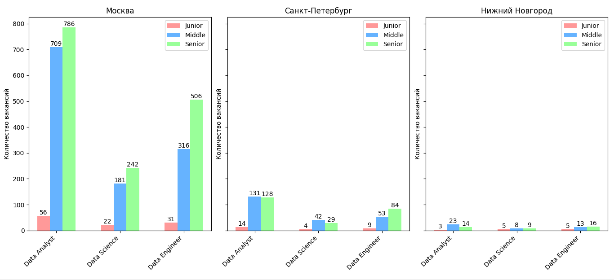

Алгоритм позволяет получить информацию о количестве вакансий по направлениям Data Analyst, Data Science и Data Engineer в разрезе уровней (Junior, Middle, Senior). 
Результаты предоставляются по трем городам: Москва, Санкт-Петербург, Нижний Новгород.

Результат предоставлен в графическом виде:



Для запуска кода необходимо предустановить библиотеки из файла requirements.txt

```
pip install -r requirements.txt
```
Запуск кода:
```
python3 main.py
```